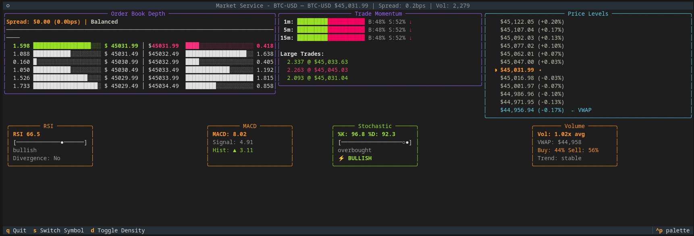

# Cognitive Protocol Architecture Market Service

A **production-grade** demonstration of **Cognitive Protocol Architecture (CPA)** - a design pattern that unifies domain modeling, type safety, and AI readiness into a single coherent approach. Built with Python 3.13+, this real-time market data service shows how CPA reduces code by 50-70% while making systems naturally interpretable by both humans and AI.

## The Problem We All Face

Every backend system suffers from the same architectural scar tissue:

```
OrderDTO → OrderMapper → Order → OrderValidator → OrderAdapter → AIPromptBuilder → ResponseParser
```

We write 5-7 classes for every domain concept. 60% defensive plumbing. 0% business value.

## The Insight: Cognitive Protocol Architecture

CPA is a design pattern where:
- **Protocols** define structural contracts (what you need)
- **Models** satisfy contracts, validate data, AND carry semantic meaning
- **Cognition** becomes native - no translation layers needed for AI integration

```python
# Traditional: 7 files, 500+ lines
# CPA: 1 file, 50 lines

class MarketTicker(BaseModel):
    """Real-time market price data"""  # ← LLMs can read this
    
    symbol: str = Field(description="Trading pair")  # ← Semantic context
    price: Decimal = Field(gt=0)  # ← Validation built-in
    timestamp: datetime
    
    # This model satisfies TickerProtocol automatically (structural typing)
    # It validates at construction (Pydantic)
    # It serializes/deserializes perfectly (no custom code)
    # It provides semantic context (for humans AND AI)
    
    def to_analysis(self) -> PriceAnalysis:
        """Transform to analysis - no mapper needed"""
        return PriceAnalysis.from_ticker(self)
```

## See It In Action

```bash
# Install dependencies
uv sync

# Set Coinbase credentials
export COINBASE_API_KEY="your-api-key"
export COINBASE_API_SECRET="your-api-secret"

# Run the live dashboard
python run_dashboard.py
```



Watch real-time market data flow through a CPA system:
- **Zero defensive code** after the edge
- **Natural transformations** between models
- **Rich analytics** from simple compositions
- **AI-ready data** at every step

## Why CPA Changes Everything

### 1. The Convergence of Three Forces

```
Domain-Driven Design: "Models should speak the ubiquitous language"
                +
Schema-Driven Design: "Models should be validated and structured"
                +
Language Models: "Models should be interpretable and reasoning-capable"
                =
Cognitive Protocol Architecture
```

### 2. Code That Understands Itself

Every model provides multiple representations:

```python
class RSIAnalysis(BaseModel):
    """Relative Strength Index momentum indicator"""
    
    # For systems (type-safe, validated)
    rsi_value: float = Field(ge=0, le=100)
    period: int = Field(default=14)
    
    # For humans (semantic meaning)
    @property
    def momentum_state(self) -> Literal["oversold", "neutral", "overbought"]:
        if self.rsi_value < 30:
            return "oversold"
        elif self.rsi_value > 70:
            return "overbought"
        return "neutral"
    
    # For AI (natural language)
    def explain(self) -> str:
        return f"RSI at {self.rsi_value:.1f} indicates {self.momentum_state} conditions"
    
    # For ML (feature extraction)
    def to_features(self) -> dict[str, float]:
        return {
            "rsi": self.rsi_value,
            "rsi_oversold": float(self.rsi_value < 30),
            "rsi_overbought": float(self.rsi_value > 70),
        }
```

### 3. AI Integration Without Integration

Traditional systems need entire layers for AI:
- Prompt templates
- Response parsers
- Validation pipelines
- Error handling for malformed outputs

CPA systems speak AI natively:

```python
# The model IS the prompt structure AND the response validator
market_insight = await llm.analyze(
    market_snapshot.model_dump(),
    response_model=MarketInsight  # ← Pydantic model defines expected structure
)
# Type-safe, validated, guaranteed structure - no parsing needed
```

## Architecture Overview

### The CPA Flow

```
WebSocket → CoinbaseTicker → MarketTicker → MarketSnapshot → TechnicalAnalysis → TradingSignal
    ↓              ↓               ↓                ↓                  ↓                ↓
validates    transforms      enriches         analyzes          explains         decides

Each arrow is just a method call. No mappers. No defensive code. Full type safety.
```

### Core Components

```
src/market/
├── protocols/      # Structural contracts (what we need)
├── models/         # Domain models (satisfy protocols + carry meaning)
├── adapters/       # External integrations (transform to our models)
├── analysis/       # Business logic (models transforming models)
├── service/        # Orchestration (composition of models)
└── ui/            # Presentation (models rendering themselves)
```

### Key Principles

#### 1. Protocol-Model Duality
Any model with the right fields satisfies a protocol automatically:

```python
@runtime_checkable
class TickerProtocol(Protocol):
    @property
    def price(self) -> Decimal: ...
    @property
    def timestamp(self) -> datetime: ...

# These ALL satisfy TickerProtocol with zero boilerplate
class CoinbaseTicker(BaseModel):
    price: Decimal
    timestamp: datetime

class BinanceTicker(BaseModel):
    price: Decimal  
    timestamp: datetime

class MockTicker(BaseModel):
    price: Decimal
    timestamp: datetime
```

#### 2. Composition Over Layers

```python
class MarketSnapshot(BaseModel):
    """Point-in-time market state"""
    ticker: MarketTicker
    order_book: OrderBook
    recent_trades: list[Trade]
    
    def to_momentum_analysis(self) -> MomentumAnalysis:
        """Models transform into each other naturally"""
        return MomentumAnalysis(
            price_direction=self.calculate_direction(),
            volume_trend=self.analyze_volume(),
            trade_imbalance=self.calculate_imbalance()
        )
```

#### 3. Fail-Fast Validation

```python
# At the boundary - validate once
raw_data = websocket.receive()
ticker = CoinbaseTicker.model_validate_json(raw_data)  # ← Fails here if invalid

# Rest of the system is guaranteed valid
# No defensive programming needed
market_ticker = ticker.to_market_ticker()  # ← Can't fail
snapshot = market_ticker.to_snapshot()     # ← Can't fail
analysis = snapshot.to_analysis()          # ← Can't fail
```

## Real-World Impact

### Traditional Architecture (10,000 lines)
```
├── DTOs/              2,000 lines
├── Mappers/           1,500 lines  
├── Validators/        1,500 lines
├── Domain/            2,000 lines
├── Adapters/          1,500 lines
├── AI Integration/    1,500 lines
```

### CPA Architecture (3,000 lines)
```
├── Models/            1,500 lines (includes validation, transformation, behavior)
├── Adapters/            500 lines (external API shapes only)
├── Services/          1,000 lines (business logic and orchestration)
```

**But it's not just about less code.** It's about code that can explain itself, validate itself, and integrate with cognitive systems naturally.

## Technical Deep Dive

### Performance & Scalability

- **Async-first**: Built on Python 3.13+ asyncio
- **WebSocket streaming**: Real-time data with automatic reconnection
- **Pandas-powered**: Vectorized operations for technical indicators
- **Smart caching**: TTL-based caches for expensive calculations
- **Zero-copy flow**: Models transform without redundant copying

### Type Safety & Developer Experience

```python
# Every function is fully typed
async def analyze_market(
    snapshot: MarketSnapshot,
    indicators: list[type[BaseIndicator]] | None = None,
) -> IndicatorResult:
    """Modern Python type hints throughout"""
```

- **100% type coverage** with `mypy --strict`
- **Runtime validation** via Pydantic v2
- **Protocol verification** at module boundaries
- **Self-documenting** with semantic names and docstrings

### AI/ML Feature Engineering

The service is already a feature pipeline:

```python
# Each model provides features at multiple levels
market_snapshot
├── .to_features()      # Raw numerics for ML
├── .to_categorical()   # Encoded states for classification  
├── .to_embedding()     # Vector representation
└── .explain()          # Natural language for LLMs

# Complete pipeline in one line
features = [
    indicator.to_features() 
    for indicator in await analyze_market(snapshot)
]
```

### Testing & Quality

```bash
# Full test suite
pytest --cov=market --cov-report=term-missing

# Type checking
mypy src/ --strict

# Code formatting
ruff check src/
black src/ --check
```

## Example: Adding a New Exchange

Traditional architecture requires:
1. Create DTO
2. Create mapper
3. Create adapter interface
4. Create adapter implementation
5. Update dependency injection
6. Add tests for each layer

CPA requires:

```python
# 1. Define the adapter model
class KrakenTicker(BaseModel):
    pair: str = Field(alias="wsname")
    last: Decimal = Field(alias="c[0]")
    
    def to_market_ticker(self) -> MarketTicker:
        return MarketTicker(
            symbol=self.pair,
            price=self.last,
            timestamp=datetime.now(UTC)
        )

# 2. Use it
ticker = KrakenTicker.model_validate(kraken_data)
market_ticker = ticker.to_market_ticker()

# Done. No other files to modify.
```

## The Philosophy

> "We honor everything we've learned about good systems design AND provide an elegant bridge to cognitive computing."

CPA isn't a framework or a library. It's a pattern that emerges when you:
1. Trust your models to validate themselves (Pydantic)
2. Define contracts through structure, not inheritance (Protocols)
3. Let models carry their meaning (semantic methods)
4. Embrace composition over layering

The result: Systems that are simpler, safer, and ready for the cognitive era.

## Get Started

```bash
# Clone the repo
git clone https://github.com/kylejtobin/cognitive-protocol-arch-market-service.git
cd cognitive-protocol-arch-market-service

# Install dependencies
uv sync

# Run the example
python run_dashboard.py
```

## Learn More

- **Pattern Definition**: [Cognitive Protocol Architecture Explained](docs/cpa-pattern.md)
- **Architecture Decision Records**: [docs/adr/](docs/adr/)
- **API Documentation**: [docs/api/](docs/api/)

## Contributing

This is a demonstration of CPA principles. Feel free to:
- Explore the codebase
- Try the pattern in your own projects
- Share your experiences
- Suggest improvements

## License

MIT

---

*The future of software isn't about adding AI to existing systems - it's about building systems that are intrinsically interpretable. CPA shows us how.*
