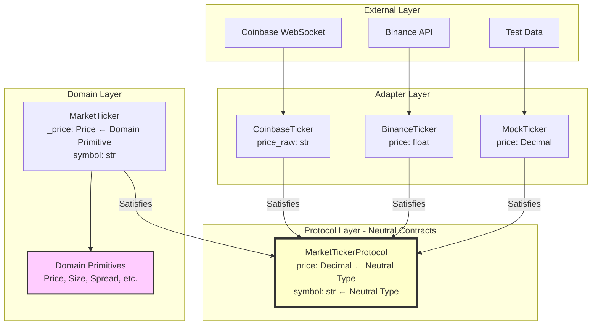
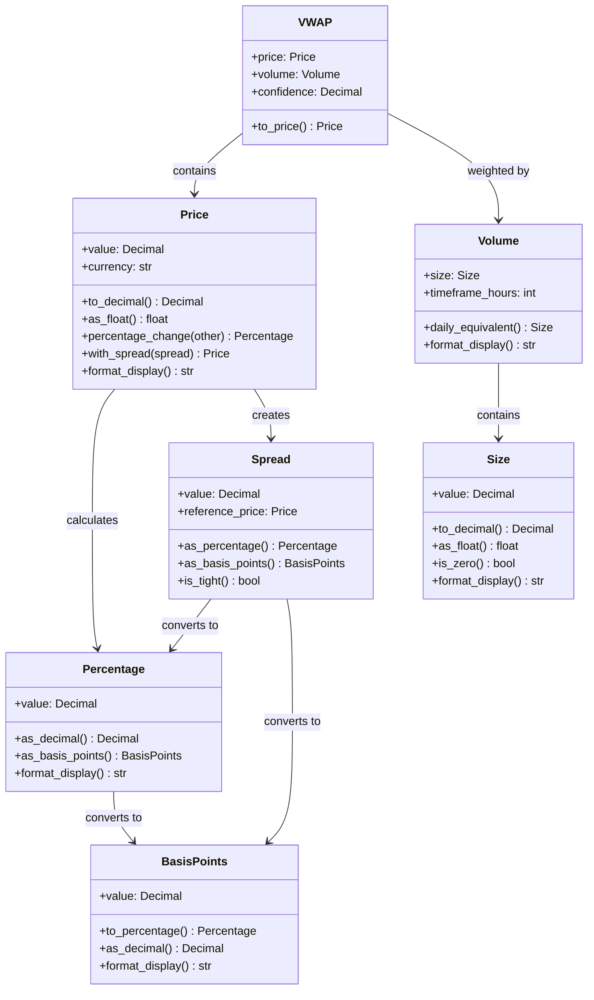
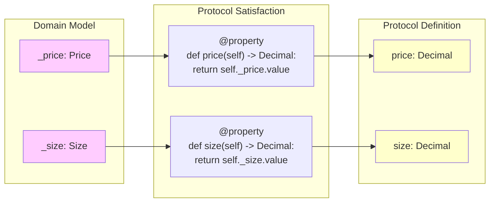
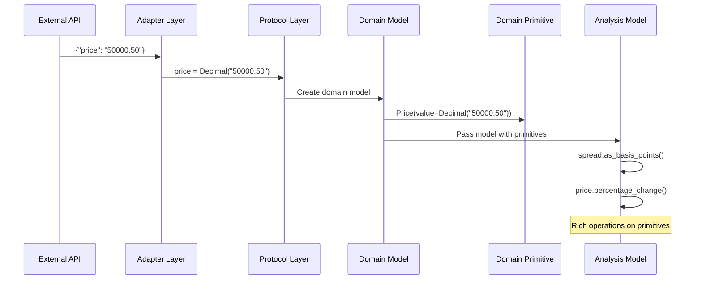

# Domain Primitives Architecture

## Overview

Domain primitives provide semantic meaning to values in our market data system. They work in harmony with our protocol-based architecture, where protocols define neutral contracts and domain models provide rich behavior.

## The Protocol-Model-Primitive Architecture



## Domain Primitives Design

### Core Primitives



## Protocol Satisfaction Pattern

The key insight is that protocols define **what** data is needed, while domain primitives define **how** to work with that data:



## Data Flow Example

Here's how data flows through the system with domain primitives:



## Benefits

1. **Semantic Clarity**: `price.calculate_stop_loss(0.02)` vs `price * Decimal("0.98")`
2. **Encapsulated Logic**: VWAP calculation in one place
3. **Type Safety**: Can't accidentally pass a size where a price is expected
4. **Protocol Compliance**: Still satisfies all protocol contracts
5. **Testability**: Test primitive behavior once, use everywhere

## Example Usage

```python
# External adapter - no knowledge of primitives
class CoinbaseTicker(BaseModel):
    price_raw: str = Field(alias="price")

    @property
    def price(self) -> Decimal:  # Satisfies protocol
        return Decimal(self.price_raw)

# Domain model - rich primitives internally
class MarketTicker(BaseModel):
    _price: Price

    @property
    def price(self) -> Decimal:  # Satisfies protocol
        return self._price.value

    def calculate_spread_to(self, other: "MarketTicker") -> Spread:
        """Rich domain operation"""
        return Spread(
            value=abs(self._price.value - other._price.value),
            reference_price=self._price
        )

# Usage in analysis
def analyze_market(ticker: MarketTickerProtocol) -> dict:
    # Works with any implementation
    raw_price = ticker.price  # Always Decimal

    # Convert to domain model for rich operations
    if isinstance(ticker, MarketTicker):
        spread_bps = ticker._price.to_spread().as_basis_points()
    else:
        # Fallback for non-domain models
        spread_bps = calculate_spread_basis_points(raw_price)
```

## Migration Strategy

The beauty of this design is that it can be adopted incrementally:

1. **Phase 1**: Implement primitives
2. **Phase 2**: Update domain models to use primitives internally
3. **Phase 3**: Gradually migrate analysis code to use primitive methods
4. **Phase 4**: Update UI to use formatting methods

Throughout all phases, protocols remain unchanged and all existing code continues to work.
