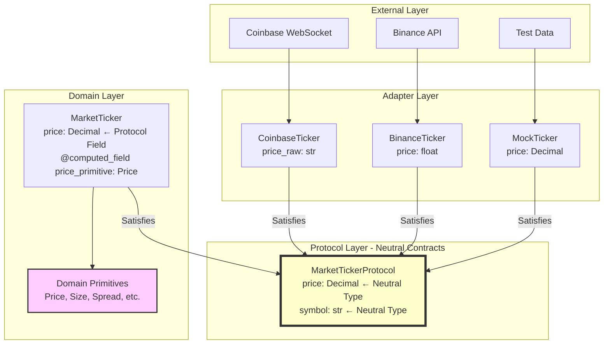
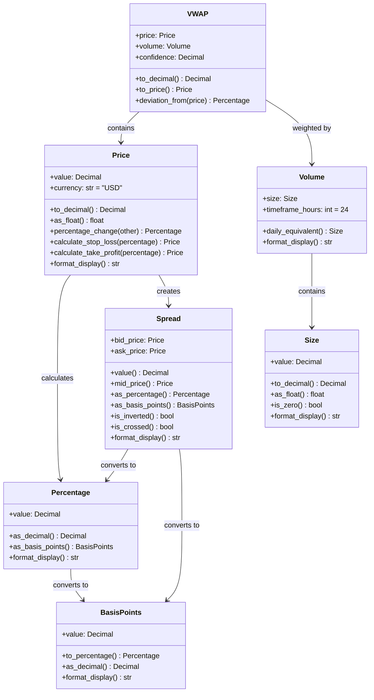
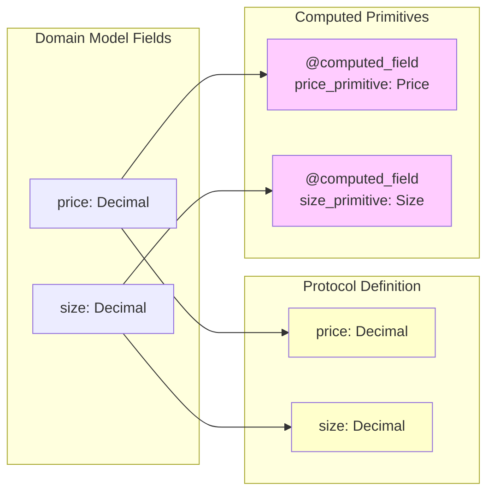
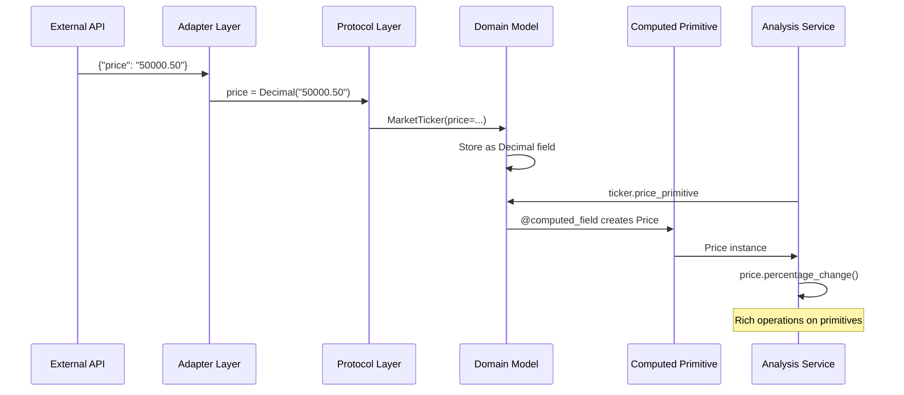

# Domain Primitives Architecture

## Overview

Domain primitives provide semantic meaning to values in our market data system. They work in harmony with our protocol-based architecture, where protocols define neutral contracts and domain models provide rich behavior through computed fields.

## The Protocol-Model-Primitive Architecture



## The Computed Field Pattern

The key insight is using Pydantic's `@computed_field` to expose domain primitives while storing protocol-compliant types:

```python
class MarketTicker(BaseModel):
    # Store protocol-compliant types as fields
    price: Decimal  # Satisfies protocol directly
    size: Decimal
    
    # Expose domain primitives as computed fields
    @computed_field  # type: ignore[misc]
    @property
    def price_primitive(self) -> Price:
        """Price as domain primitive for calculations."""
        return Price(value=self.price)
    
    @computed_field  # type: ignore[misc]
    @property
    def size_primitive(self) -> Size:
        """Size as domain primitive for calculations."""
        return Size(value=self.size)
    
    # Rich domain operations use primitives internally
    def price_change_from(self, other: MarketTickerProtocol) -> Percentage:
        """Calculate percentage change - works with ANY protocol implementation!"""
        other_price = Price(value=other.price)
        return self.price_primitive.percentage_change(other_price)
```

### Benefits of Computed Fields

1. **No Storage Duplication**: Store data once, compute primitives on demand
2. **Cached by Default**: Pydantic caches computed fields for performance
3. **Clean Serialization**: Computed fields excluded from JSON by default
4. **Simple Mental Model**: Fields store data, computed fields derive state
5. **Type Safety**: Full type checking for both storage and primitives

## Domain Primitives Design

### Core Primitives



## Protocol Satisfaction Pattern

The computed field pattern provides the cleanest way to satisfy protocols while maintaining rich domain behavior:



## Data Flow Example

Here's how data flows through the system with domain primitives:



## Real Implementation Example

```python
class MarketTicker(BaseModel):
    """Market ticker with rich domain behavior."""
    
    # Protocol-compliant fields (stored as Decimal)
    symbol: str = Field(..., min_length=1, max_length=20)
    price: Decimal = Field(..., gt=0)
    size: Decimal = Field(..., gt=0)
    bid: Optional[Decimal] = Field(None, gt=0)
    ask: Optional[Decimal] = Field(None, gt=0)
    
    # Computed domain primitives
    @computed_field  # type: ignore[misc]
    @property
    def price_primitive(self) -> Price:
        return Price(value=self.price)
    
    @computed_field  # type: ignore[misc]
    @property
    def spread(self) -> Optional[Decimal]:
        """Computed spread value."""
        if self.bid is None or self.ask is None:
            return None
        return self.ask - self.bid
    
    # Rich domain operations
    def spread_percentage(self) -> Optional[Percentage]:
        """Calculate spread as percentage of mid price."""
        if self.spread is None:
            return None
        mid = (self.bid + self.ask) / Decimal("2")
        return Percentage(value=(self.spread / mid) * 100)
    
    def is_liquid(self, max_spread_bps: int = 10) -> bool:
        """Check if market is liquid."""
        spread_bps = self.spread_basis_points()
        return spread_bps is not None and spread_bps <= max_spread_bps
```

## Benefits

1. **Semantic Clarity**: `ticker.price_primitive.calculate_stop_loss(Decimal("0.02"))` expresses intent
2. **No Storage Overhead**: Primitives computed only when accessed
3. **Protocol Compliance**: Models satisfy protocols without modification
4. **Type Safety**: Can't mix prices and sizes
5. **Clean Serialization**: `model_dump()` excludes computed fields by default

## Anti-Patterns to Avoid

```python
# ❌ Don't use PrivateAttr
class BadModel(BaseModel):
    price_input: Decimal = Field(alias="price")
    _price: Price = PrivateAttr()  # Complex and confusing

# ❌ Don't store computed values
class BadModel2(BaseModel):
    price: Decimal
    price_doubled: Decimal  # Should be @computed_field

# ❌ Don't use regular @property
class BadModel3(BaseModel):
    @property
    def spread(self) -> Decimal:  # Use @computed_field!
        return self.ask - self.bid
```

## Migration Strategy

The computed field pattern makes migration straightforward:

1. **Phase 1**: Add computed primitive properties to existing models
2. **Phase 2**: Update domain operations to use primitives internally  
3. **Phase 3**: Services can gradually adopt primitive usage
4. **Phase 4**: UI can use primitive formatting methods

Throughout all phases, protocols remain unchanged and all existing code continues to work. The pattern supports incremental adoption without breaking changes.
